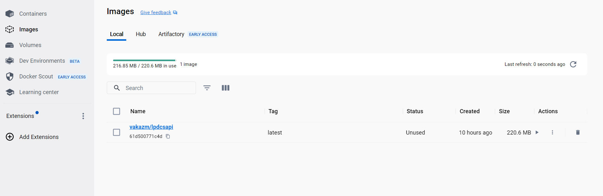
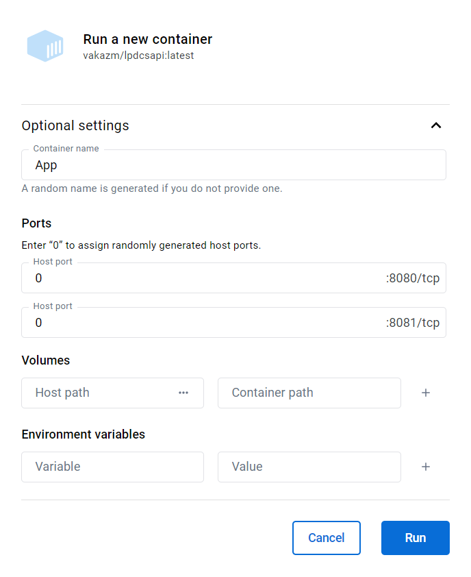
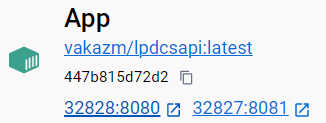
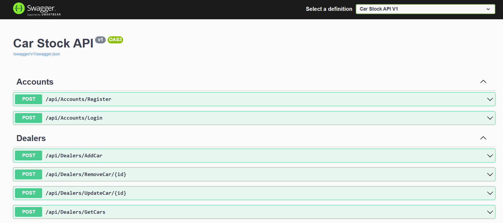

# Car strock API

The following project is an implementation of Leon Programming Developer Car Stock API, named LPDCSAPI as an abbreviature of the task name.
The solution is written in Visual Studio using ASP .NET Core and Swagger.
The source code is available on [GitHub](https://github.com/Vakazm/LPDCSAPI), and the executable version can be found on [DockerHub](https://hub.docker.com/repository/docker/vakazm/lpdcsapi/general).

## Running in Docker

To run the project in Docker you should first obtain its image from DockerHub.
To do so, you should execute the following command into the command prompt:

```cmd
docker pull vakazm/lpdcsapi
```

After image is pulled you will see it among your images in Docker Desktop.



Next, please press run and assign desired numbers to the ports. You can put zeros there for random host ports.



Finally, when container is created, you can run it and access the Swagger UI by clicking the first host port.



Now you should be able to see Swagger main page with all the API methods.



If you have any questions regarding any part of this project please feel free to contact me.
